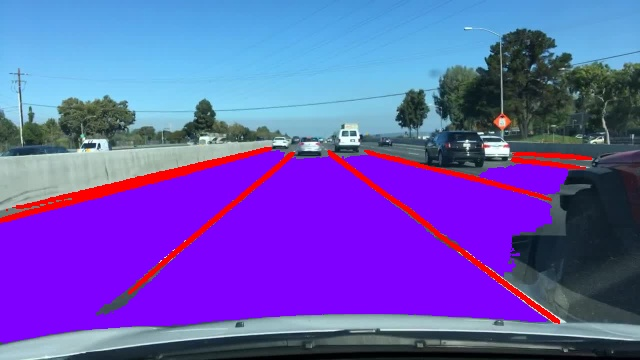

<div align="center">

# TwinLiteNet ONNX Model Inference with OpenCV DNN

</div>

This repository contains a C++ implementation for performing inference with the state-of-the-art [TwinLiteNet model](https://github.com/chequanghuy/TwinLiteNet) using OpenCV's DNN module. TwinLiteNet is a cutting-edge lane detection and drivable area segmentation model. This implementation offers support for both CUDA and CPU inference through build options.

<div align="center">

</div>

<br>

## Acknowledgment 🌟

I would like to express sincere gratitude to the creators of the [TwinLiteNet model](https://github.com/chequanghuy/TwinLiteNet) for their remarkable work .Their open-source contribution has had a profound impact on the community and has paved the way for numerous applications in autonomous driving, robotics, and beyond.Thank you for your exceptional work.

<br>

## Project Structure
```
.
├── CMakeLists.txt
├── LICENSE
├── README.md
├── assets
├── include
│   └── twinlitenet_dnn.hpp
├── models
│   └── best.onnx
└── src
    ├── main.cpp
    └── twinlitenet_dnn.cpp
```
<br>

## Requirements

- OpenCV 4.8 +
  
<br>

## Build Options

- **CUDA Inference:** To enable CUDA support for GPU acceleration, build with the `-DENABLE_CUDA=ON` CMake option.
- **CPU Inference:** For CPU-based inference, no additional options are required.

<br>

## Usage

1. Clone this repository.
2. Build the project using CMake with your preferred build options.
```cpp
mkdir build
cd build
cmake  -DENABLE_CUDA=ON ..
make -j8
```
4. Execute `./main` and Enjoy accurate lane detection and drivable area results!

<br>

## License

This project is licensed under the [MIT License](LICENSE). Feel free to use it in both open-source and commercial applications.

<br>

## Extras
- [TwinLiteNet](https://github.com/chequanghuy/TwinLiteNet)
- [TwinLiteNet-ONNX-Runtime](https://github.com/harrylal/TwinLiteNet-onnxruntime)
